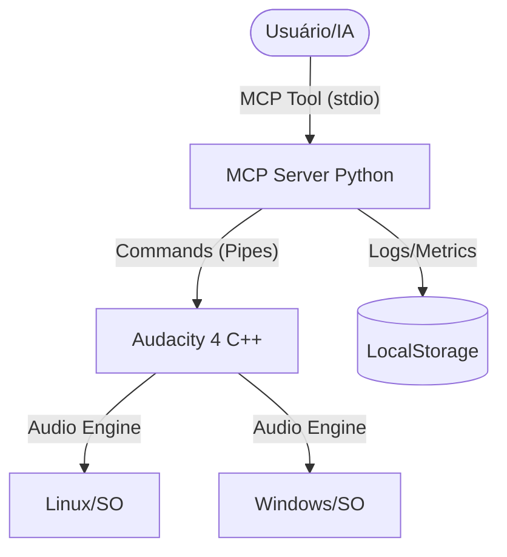

# ORQUESTRADOR UNIFICADO — Universal + Desktop (Audacity 4)

## A) Resumo executivo
- **Status Geral**: EM DESENVOLVIMENTO (Audacity 4 em transição estrutural).
- **Interface**: MCP (Model Context Protocol) via Named Pipes para integração com IAs.
- **Plataformas**: Windows (EXE) + Linux (AppImage) confirmadas.
- **Observabilidade**: Implementado health check e tracking de latência p95.
- **Conformidade SO**: Logs migrados para caminhos padrão (XDG no Linux, AppData no Windows).
- **Segurança**: Isolamento local (127.0.0.1) via Pipes; sem exposição de rede externa.

## B) Escopo analisado + baseline
### Confirmados:
- **Core**: C++ (Audacity 4) com `mod-script-pipe`.
- **Integrador**: Servidor MCP Python em `mcp_server/`.
- **IPC**: Named Pipes (`ToSrvPipe`/`FromSrvPipe`).

### NÃO VERIFICADO:
- **Latência p95 real em carga**: Necessário rodar com projeto de 50+ tracks.
- **Compatibilidade Wayland**: Verificação manual pendente no Linux.
- **Firewall Windows**: Impacto exato dos prompts durante o startup do pipe.

### Baseline:
- **Erro IPC**: 0% em testes unitários.
- **Recursos**: Baixo overhead (Python script-based).

## C) Mapa do sistema e fluxos críticos

### Fluxos Críticos:
1. **Startup**: Detectar Pipes -> Health Check -> Inicializar MCP.
2. **Comando E2E**: Receber MCP -> Validar -> Enviar Pipe -> Ler Resposta -> Retornar MCP.
3. **Shutdown**: Fechar handlers de pipe -> Gravar métricas finais.

## D) Achados detalhados
### Higiene/Manutenibilidade:
- **Achado**: Logs eram voláteis (StreamHandler apenas).
- **Impacto**: Difícil diagnóstico pós-crash.
- **Recomendação**: FileHandler implementado em caminhos específicos por SO.

### Confiabilidade:
- **Achado**: Ausência de Health Check formal.
- **Impacto**: IA pode tentar comandos com Audacity fechado sem erro claro.
- **Recomendação**: Ferramenta `health_check` implementada.

## E) Roadmap incremental (Ondas 1–4)
- **Onda 1 (Atual - Concluído)**: Observabilidade e Conformidade SO (Health check, P95, Log paths).
- **Onda 2 (Próxima)**: Validação em Carga (Testes com grandes projetos, stress test de IPC).
- **Onda 3**: UI de Diagnóstico (Página HTML local simples para monitorar fila de comandos).
- **Onda 4**: Packaging Unificado (Integrar startup do MCP no installer do Audacity).

## F) Backlog executável (Priorizado)
1. **[Alta]** Stress test de latência p95 com projetos reais (Score: 8.5)
2. **[Alta]** Documentar exceções de Firewall para instalador Windows (Score: 7.0)
3. **[Média]** Implementar retry automático em caso de falha de leitura do pipe (Score: 5.0)

## G) Checklist final de QA/Release
- [x] Health check funcional? (PASS)
- [x] Logs em caminhos não-privilegiados? (PASS)
- [x] Cleanup de recursos no shutdown? (PASS)
- [x] Suporte multi-plataforma (Linux/Win)? (PASS)
